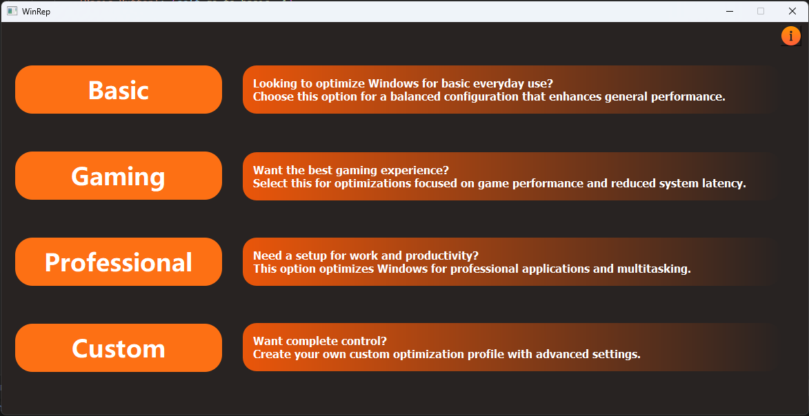

# WinRep: Simplified Windows Configuration Tool

WinRep is an all-in-one tool that simplifies Windows setup, installation, and optimization. It helps users install apps, remove bloatware, apply tweaks, and improve performance with minimal effort. Ideal for both beginners and advanced users looking to save time.

## 💡 Usage
WinRep must be run in Admin mode because it performs system-wide tweaks.
To achieve this, run `main.py` as an administrator.

## ❤️ Getting Started
1. **Install Requirements** Run the `requirements.bat` file to install all necessary dependencies before running the application.
2. **Run The App** Run `main.py` as an administrator
3. **Choose Your Configuration Profile** (gaming, programming, general use, or custom setup).
4. **Let WinRep Handle the Rest**: It will install necessary applications, apply tweaks, and remove bloatware automatically.
5. **Enjoy a Fully Optimized Windows Setup** without unnecessary manual intervention ❤️.

## 🎓 Features
- **Automated Application Installation**: Install multiple applications easily using **winget and choco**, and other package managers.
- **Windows Tweaks**: Customize and optimize your system by enabling only the features you need while removing unnecessary ones.
- **One-Click Configuration Profiles**: Apply predefined or customizable profiles for gaming, programming, and general use.
- **User-Friendly Interface**: Designed to be easy to use, requiring minimal setup and maintenance.

## License
This project is licensed under the [MIT License](LICENSE).

## Contact
For questions or support, please reach out to [your contact details or GitHub repository].

